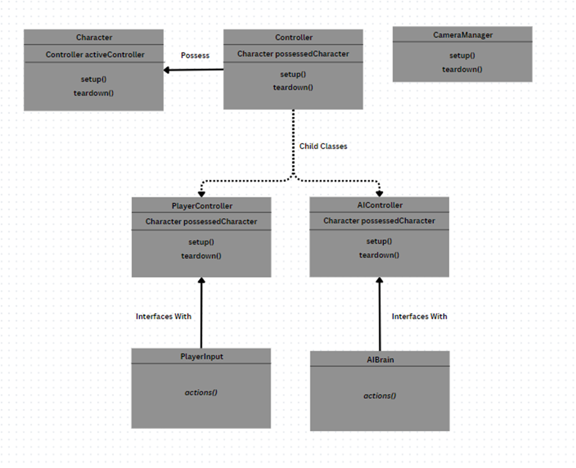

# Unity Starter Template Documentation
By: Digx7
Last Updated: 1/4/2025

## Introduction
This is the documentation for the Unity Starter Template developed by Digx7 and accessible here: <https://github.com/Digx7/Unity-Starter-Template> 
This Unity Starter Template is designed to help you get started prototype or developing games by handling much of the common backend systems that large games use.  That’s not to say you won’t need to adjust these systems as your project progresses, but this gives you a starting point.

### Purpose
This document is meant to help explain the systems in the template by itself.  Use this document to get familiar with the starter template before jumping into a project.  Or to refresh yourself on how a particular system works.  But do know that as your own project built on this carries on this document will become less and less relevant as you build on these systems.

### How To Use This Document
Each of the following sections relates to one system or collection of systems that work closely together.  They each contain a section on their Purpose, How To Extend them, and any further Notes.  Some contain more sections as needed.

## Channels

### Purpose
Channels are ScriptableObjects with UnityEvents that allow two or more systems to communicate through the Channel using said UnityEvents without having any coupling or dependency between the two or more systems.
The Publish-subscribe pattern pattern (also called the Observer Patter) is a pattern that allows systems to communicate that events have happened without needing to care what other systems do in response to that event happening.  One downside of this pattern is that for one system to start listening (subscribing) to another system that is publishing events, the subscriber needs a direct reference to the publisher.  This can create a dependency between the subscriber and the publisher and throw strange errors if the publisher does not exist at the moment the subscriber tries to subscribe.  Channels solve this problem by being an always loaded middle man.  Subscribers can instead subscribe to the channel and be notified whenever the publisher calls the `Raise()` method of the channel.  This solves the previous issue as the publisher does not need to exist for the Subscribers to subscribe to a channel.  It also allows any system to act as a publisher by calling the `Raise()` function on a given channel, allowing for many-to-many relationships.
	

For further reading on the Publish-subscribe pattern see:
<https://learn.microsoft.com/en-us/azure/architecture/patterns/publisher-subscriber>
<https://www.geeksforgeeks.org/what-is-pub-sub/>
<https://refactoring.guru/design-patterns/observer> 

The implementation is similar to what is seen here: [Game architecture with ScriptableObjects | Open Projects Devlog](https://www.youtube.com/watch?v=WLDgtRNK2VE) Relevant section starts at 5:45.

### How To Use
**Subscribing To A Channel**

**IMPORTANT**: For any event that a system subscribes to make sure it UNSUBSCRIBES before being destroyed.  Otherwise it will throw an error when that event is raised.  These errors can be very hard to track down in the inspector.

**NOTE**: There are a variety of Channels that can pass different data types as arguments.  The below example is just in the case of the Channel class that passes no data as arguments.  If you use something like the IntChannel class that passes an Int as an argument the method that you attach to it through the `AddListener()` method must also take a single argument of an Int.

Example:

    using UnityEngine;

    Public class SubscribingToAChannel : MonoBehavior
    {
        Public Channel myChannel;

        Public void OnEnable()
        {
            SetupChannels();
        }

        Public void OnDisable()
        {
            TeardownChannels();
        }

        Public void SetupChannels()
        {
            myChannel.channelEvent.AddListener(myFunction);
        }

        Public void TeardownChannels()
        {
            myChannel.channelEvent.RemoveListener(myFunction);
        }

        Public void MyFunction()
        {
            Debug.Log("MyFunction()");
        }

    }

**Raising A Channel**

Public void `Raise()`;

Example:

    using UnityEngine;

    public class RaisingAChannel : MonoBehavior
    {
        public Channel myChannel;

        public void Start()
        {
            myChannel.Raise();
        }
    }

### How To Extend
**Making a new channel of an existing type**
1.	In unity right click in the project panel and choose `Create/ScriptableObjects/Channels`.
2.	There you will see all the existing channel types, choose one.

NOTE on  Channel Naming Conventions: For your sanity it is recommended to use this naming convention for Channels.  Channels that start with ‘On’ are used for AFTER OR DURING  an event.  Such as `OnPlayerDeath`, `OnGameStart`, or `OnPlayerWin`.  Channels that start with ‘Request’ are channels that are asking for some event to happen.  Such as `RequestLoadScene`, `RequestChangeGameMode`, `RequestKillPlayer`.

**Making a new channel type**
1.	Duplicate the C# script for an existing channel.  These can be found in `Scripts/ScriptableObjects/Channels`
2.	Rename the file and class name to the name of the channel type.  A recommended naming convention is DataType + Channel (i.e. BooleanChannel, FloatChannel, IntChannel).
3.	On Line 5 (where it says ‘CreateAssetMenu’) change the ‘fileName’ and ‘menuName’ property to fit.
4.	On Line 8 change the UnityEvent variable to an Event type that makes sense.  There are a number of custom UnityEvents that can be found in ‘`Scripts/Utilities/CustomEvent.cs`’.  If you need to make your own Custom UnityEvent it is recommended to add it here. 
5.	If needed, update the `Raise()` method to include any needed arguments.  Add these same arguments in the `channelEvent.Invoke()` method as needed.  See other channels for examples.
### Notes
Well Channels are used extensively in this template do not feel like your project has to be bound by them.  There are some cases where you need to query a specific value of an object and channels are not built for that.  But do keep in mind that channels do reduce the amount of dependencies between systems.

## GameManager

### Purpose
The GameManager is meant to be the highest level Singleton object in any scene.  It is supposed to exist from the moment the player starts the game and never be deleted until the game is closed.  Useful for any high level or persistent data.
In this template its main use is loading or unloading GameMode objets.  Though it can be extended as needed.

Further reading on the Singleton Pattern :
<https://refactoring.guru/design-patterns/singleton >
<https://gameprogrammingpatterns.com/singleton.html >
<https://www.geeksforgeeks.org/singleton-design-pattern/ >

### How To Extend
The only way to extend the GameManager is to add more methods to the class which can be found at `Scripts/Manager/GameManager.cs`.  There is no inherently wrong way to extend it but a few things you should think about.  Like:
It is recommended any methods that can be called by other systems be done using a ‘Request’ Channel.  
As your project scales consider how to properly load any given scene for testing and development purposes as well as for the final game.  This rule also applies to any persistent data or managers that live between scenes.  At the moment this Template makes use of SceneSetupManagers (found in `Scripts/SceneHelpers/SceneSetupManagers.cs`) to properly set up a scene.

### Notes
Depending on your project this system may need heavy modification or may never be touched.

## GameMode

### Purpose
A GameMode is meant to be the second highest scene object just below the GameManager and controls logic for a given GameMode.
GameModes are best thought of as areas of major control changes or major game states.  Common examples include: MainMenu, Overworld, Combat (in an RPG), Exploration, etc.  Some games may only have two GameModes: MainMen, and GamePlay.  This template starts with just those two.

**Note**: There is a base GameMode class, it is recommended that all GameModes derive from that class.

### How They Function
GameModes are loaded and unloaded by the GameManager.  Each GameMode has a `Setup()` and `Teardown()` method that is called when they are loaded or unloaded.  It is recommended that the bulk of the work done by the GameModes go in these functions.

In this template GameMode also handles spawning in the PlayerCharacter, PlayerController, and CameraManager based on given prefabs.  It makes use of the PlayerSpawnHelper to determine where exactly to spawn the player.

### How To Extend
**How to add more methods**

It is recommended that the bulk of the methods go in either the `Setup()` or `Teardown()` methods.  For any other methods that need to be queried it is recommended that you use ‘Request’ Channels.

**How to add a new GameMode**
1.	Create a new class that derives from the base class GameMode
2.	Add any or override any needed methods.  It is recommended to override the `Setup()` and `Teardown()` methods, well still calling the base.`Setup()` and base.`Teardown()` (failing to do so will cause a bug that appears to freeze the game).
3.	Create a prefab with the new GameMode class attached.  
4.	In the GameManager prefab (found under `Assets/Prefabs/Managers/`) add the new prefab to the AllGameModes property.

**Spawning The Player**
At the moment the GameMode spawns the given PlayerCharacter, PlayerController, and CameraManager prefabs using the help of the PlayerSpawnHelper class.  Depending on the needs of the game this will likely need to be reworked.

### Notes
If you do override the `Setup()` and `Teardown()` methods make sure to still call the base methods within them or else the game will appear to freeze.  This is due to that fact that the base GameMode calls a Channel when it is finished setting up and tearing down to signal to the GameManager when it is safe to load the next GameMode.  

## SceneManager

### Purpose
SceneManager (Not to be confused with UnityEngine.SceneManager) is a simple Singleton that lets any system request that the scene be changed using a ‘Request’ channel.  

Similar but unrelated to the SceneManager is the SceneSetupManager (found in `Scripts/SceneHelpers/`).  SceneManager loads and unloads the scenes whereas SceneSetupManager helps setup a given scene once it is loaded.

Further reading on the Singleton Pattern :
<https://refactoring.guru/design-patterns/singleton >
<https://gameprogrammingpatterns.com/singleton.html >
<https://www.geeksforgeeks.org/singleton-design-pattern/> 

### How To Use
Simply use the following Channels: RequestChangeScene, RequestAddScene, RequestRemoveScene.

**RequestChangeScene:**  Takes the string name of a given scene and loads it as the only scene.
If you just want to swap the primary scene, use this.
Note: requires the scene to be added to the build settings under `File/Build Settings`.

**RequestAddScene:** Takes the string name of a given scene and adds it to the existing scenes.  Useful if you want more than one scene loaded at once.
Note: requires the scene to be added to the build settings under `File/Build Settings`.

**RequestRemoveScene:**  Takes the string name of a given scene and removes it from the existing scenes.  Useful if you have more than one scene loaded at once.###

### How To Extend
Other than adding more methods to the class there is no real way to extend this class.  Extension of it is most likely not needed.

### Notes
To load any scene it requires it to be added to the build setting sunder `File/Build Settings`

## MusicManager

### Purpose
A Singleton class that allows for music to continuously play across scenes, crossfade between tracks, and allow songs with multiple layers that dynamically switch as gameplay progresses.

Further reading on the Singleton Pattern :
<https://refactoring.guru/design-patterns/singleton >
<https://gameprogrammingpatterns.com/singleton.html >
<https://www.geeksforgeeks.org/singleton-design-pattern/ >

### How To Use
Make use of the following channels

Channel Name	Data Type	Purpose
RequestJumpToSong	SongData	Will immediately stop playing any current song and will start playing the requested song.  Ignores the Song Queue
RequestQueueSong	SongData	Adds Song to the Queue.  Similar to a playlist, when ever a song ends or is skipped the next available song in the queue starts
RequestSkipSong		Stops playing the current song and starts playing the next song in the queue.  If there are no songs in the queue it doesn’t play anything.
RequestPauseOrResume		Pauses or Resumes the current song
RequestAddSongLayer	int	Songs can have as many layers as you want.  Under the hood these are multiple Audio Clips that are played simultaneously and can have their volume increased or decreased.  The Int references the specific song layer you want to Add.
RequestRemovoeSongLayer	int	Songs can have as many layers as you want.  Under the hood these are multiple Audio Clips that are played simultaneously and can have their volume increased or decreased.  The Int references the specific song layer you want to Remove.

### How To Extend
**How to add a new song**
1.	In Unity in the Project Panel right click and choose `Create/ScriptableObjects/Audio/Songs`
2.	Fill out the data in this ScriptableObject

### Notes
A common place to change music is between scenes, the SceneSetupManager, already can request a new song when a scene is loaded.
If the requested song is the exact same song as the one already playing than the new request is ignored.

## UI

### Overview
UI (User Interface) has the interesting problem of being composed of a bunch of individual visual systems that need references to all kinds of other systems and components in the game.  Weather that be the player health, ability cooldowns, enemy health, shop prices, etc.  Well it can be tempting to create hard references between these, these dependencies don’t scale well for larger projects.  This runs into issues if you want the UI to load or unload as needed (no need to show the player health bar outside of combat) or if you later want to update that player health system and now have to think about how the UI animates.  

To solve these issues this template uses a few different solutions.  Firstly it divides up all UI elements into widgets that derive from a UIWidget class.  It is best to break UI elements up into separate Widgets that make sense (for example a player health bar and ammo count would be separate Widgets).  Secondly it makes use of a UIWidgetManager Singleton to handle the loading and unloading of UIWidgets, it also helps to track all active UIWidgets and prevent duplicates from being loaded.  Thirdly the UIWidgetManager has a BlackBoard class that helps to facilitate transferring data from a system to a UIWidget without the need for tight coupling.  The Blackboard works similar to the Channels but maintains persistent data that can be looked up.  

### Included Widgets
All UI Widgets are made up of the following 3 things
1.	A prefab that gets loaded into the game and added to a Canvas.  Those prefabs are found in `Assets/Prefabs/UI`
2.	A custom class script that derives from UIWidget.  Those scripts are found in `Scripts/UI`
3.	A ScriptableObject of type UIWidgetData that is used to help in the loading and unloading of UI Widget

The included Widgets are listed below:

Menu Name	Purpose
SpashScreen	Shows the game title for when the game starts
MainMenu	Is the Main Menu for when the player starts the game
OptionsMenu	Gives options to the player, at the moment it just has functionality for volume controls, resolution, and fullscreen settings
PauseMenu	Show when the player pauses the game, also gives access to the options menu
CreditsMenu	Shows the credits for the game.
QuitMenu	Asks if the the player is sure if the want to quit the game or not

### UIWidgetManager

#### Purpose
To load and unload UIWidgets.  As well as to keep track of the active widgets in order to prevent duplicates from being loaded.

#### How to Use

Channel Name	Data Type	Purpose
RequestLoadUIWidget	UIWidgetData	Requests a UIWidget to be loaded
RequestUnLoadUIWidget	UIWidgetData	Request a UIWidget to be unloaded
RequestClearAllWidgets		Unloads all active UIWidgets

#### How To Extend
**How to create a new UIWidget**
1.	Create a new class that derives from UIWidget.  If needed, override the `Setup(UIWidgetData newUIWidgetData)` or `Teardown()` methods.  If making a Menu it is recommended to derive from UIMenu instead.
2.	Create a new prefab and give it the new script you just created.
3.	Create a UIWidgetData ScriptableObject and give it the prefab you just created.  To create the ScriptableObject right click in the Unity Panel and select `Create/ScriptableObjects/UI`

## Character, Controller, and CameraManager

### Purpose
Well commonly thought of as just the PlayerCharacter it is helpful to break it up into a Character, Controller, and CameraManager.  The Character is the in game avatar that the player sees moving around.  Well the Character handles things like movement, attacking, and abilities.  It importantly does not handle things like player input or the camera.  This allows us to easily change the controller input (keyboard and mouse vs. gamepad vs. touch), have an AI control the same character, or some other system (replay system) control the character.  And for the camera it lets other systems take control of the camera as needed (for cutscenes) or lets us reuse the character for AI enemies without needing the Camera.

### How It works

### How To Extend
In this template everything is included except for the actions the player does, like moving around.  These need to be implemented on the Character script found in `Scripts/Characters`.
### Notes
For player input this template makes use of the new unity input system.

